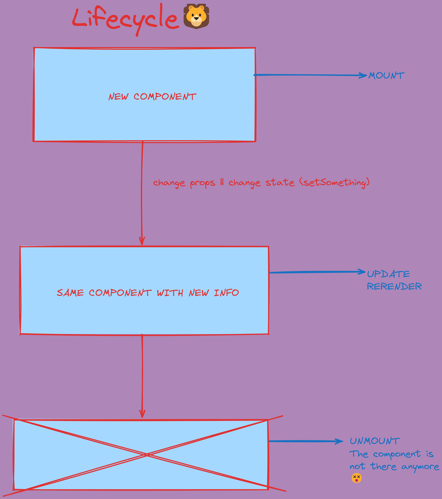

# React components lifecycle

In this class we've learned how the lifecycle of a React component works. We've learned that a component has several lifecycle methods that can be used to run code at specific times in the process.



## Fetch 
Whenever we want to get some data from an API we are going to use ``fetch`` inside the ``useEffect``, so the call is made only once:
```jsx
useEffect(() => {
  fetch('https://api.example.com/data')
    .then(response => response.json())
    .then(data => {
      // Do something with the data
    })
    .catch(error => {
      // Handle the error
    });
}, []);
```
